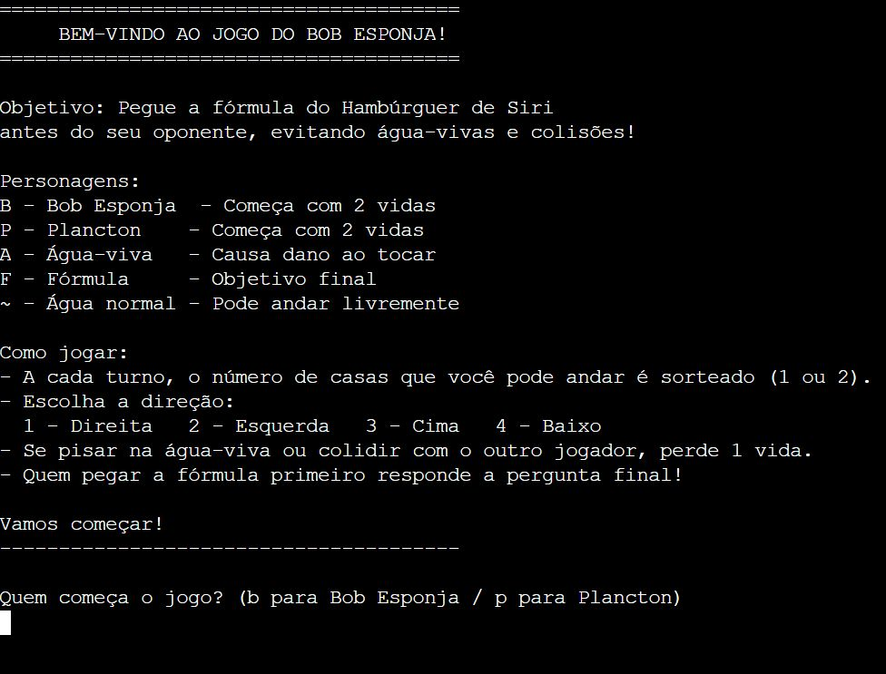

# Jogo de Tabuleiro — Bob Esponja (Java)

Projeto acadêmico desenvolvido na disciplina de Algoritmos e Programação, com o objetivo de praticar fundamentos de Java em um jogo de tabuleiro executado no console.

O jogo utiliza uma matriz 8x8, onde dois jogadores (Bob Esponja e Plâncton) competem para encontrar a Fórmula do Hambúrguer de Siri, enfrentando obstáculos e eventos aleatórios.

## Conceitos aplicados
- Matrizes (arrays bidimensionais)
- Estruturas condicionais e laços de repetição
- Métodos com parâmetros e retorno
- Entrada e validação de dados com Scanner
- Controle de estado do jogo e atualização do tabuleiro

## Execução
Compile e execute o arquivo principal (`Main.java`) em um ambiente Java.

---

## Demonstração

**Início do jogo:**

**Tabuleiro durante a partida:**

